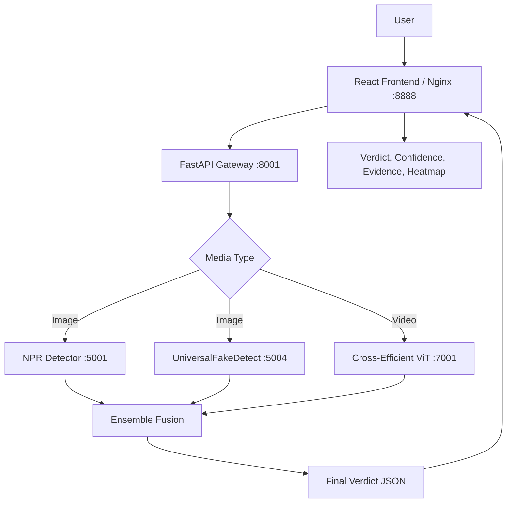
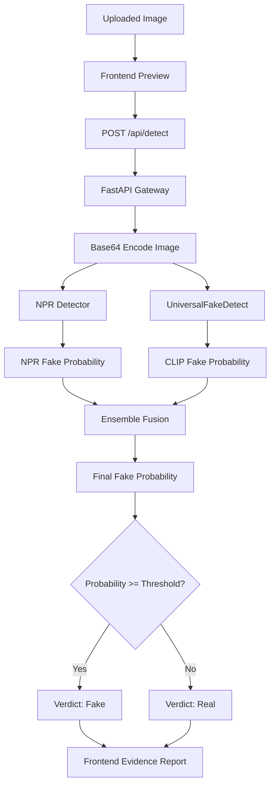
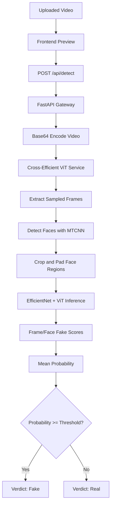

# Image and Video Analysis Architecture for DeepForensics

## Project Title

**Explainable Forensic Framework for Deepfake Detection through Visual-Semantic Consistency Analysis**

## Scope of This Document

This document explains how the image and video analysis system works in DeepForensics. It covers:

- the complete frontend-to-backend architecture,
- image analysis flow,
- video analysis flow,
- model decision logic,
- ensemble fusion,
- metrics and accuracy results available in this repository,
- dataset construction and source,
- usefulness of the system,
- limitations and future improvements.

This document intentionally focuses only on image and video analysis. Audio detection is not included in this research scope.

## High-Level System Architecture

DeepForensics is implemented as a containerized full-stack application. The user interacts with a React frontend. The frontend sends uploaded media to a FastAPI gateway. The gateway routes the media to model-specific microservices, collects model outputs, applies an ensemble decision method, and returns a structured result to the frontend.



## Active Runtime Models

The active services are defined in `config/deepsafe_config.json`.

### Image Models

| Model | Service Name | Port | Purpose |
|---|---|---:|---|
| NPR Deepfake Detection | `npr_deepfakedetection` | 5001 | Detects local pixel-level generation artifacts |
| UniversalFakeDetect | `universalfakedetect` | 5004 | Detects fake images using CLIP-based transferable visual features |

### Video Models

| Model | Service Name | Port | Purpose |
|---|---|---:|---|
| Cross-Efficient ViT | `cross_efficient_vit` | 7001 | Detects facial video manipulations using EfficientNet + Vision Transformer features |

## Supported Inputs

### Image

Configured extensions:

- `.jpg`
- `.jpeg`
- `.png`
- `.webp`
- `.bmp`
- `.gif`
- `.tiff`
- `.tif`

### Video

Configured extensions:

- `.mp4`
- `.avi`
- `.mov`
- `.mkv`

## End-to-End Request Flow

### 1. Upload

The user selects or drops an image/video in the frontend. The frontend creates a local preview and sends the file to:

```text
POST /api/detect
```

The frontend also sends:

- selected threshold,
- ensemble method,
- selected media type,
- optional model filter.

### 2. API Preprocessing

The FastAPI gateway:

1. receives the uploaded file,
2. infers media type from MIME type or file extension,
3. validates the file,
4. reads bytes,
5. base64-encodes the media,
6. constructs a normalized prediction payload.

Internally, the gateway maps media type to payload key:

| Media Type | Payload Field |
|---|---|
| image | `image_data` |
| video | `video_data` |

### 3. Model Dispatch

The gateway reads `config/deepsafe_config.json` and sends the encoded media to every configured model for that media type.

For image:

```text
npr_deepfakedetection
universalfakedetect
```

For video:

```text
cross_efficient_vit
```

Each model returns a standard response containing:

- `probability`: probability that the media is fake,
- `prediction`: binary class, where `1 = fake` and `0 = real`,
- `class`: readable label,
- `inference_time`: model processing time.

### 4. Ensemble Fusion

The gateway combines model outputs using one of three methods:

1. **Voting**
2. **Average**
3. **Stacking**

The default method in the current config is:

```json
"default_ensemble_method": "voting"
```

The default threshold is:

```json
"default_threshold": 0.5
```

### 5. Final Result

The gateway returns:

- final verdict,
- fake probability,
- model count,
- fake votes,
- real votes,
- model results,
- processing mode,
- response time,
- request ID.

The frontend converts this response into a user-facing report with:

- verdict banner,
- fake probability,
- confidence label,
- authenticity report,
- evidence summary,
- Grad-CAM-style heatmap,
- explainable forensic cues,
- verification guidance.

## Image Analysis Pipeline



### NPR Detector

Repository path:

```text
models/image/npr_deepfakedetection/
```

NPR uses a ResNet-50 based detector trained to identify neighboring pixel relationship artifacts. The wrapper performs:

1. base64 decode,
2. image resize to `256 x 256`,
3. center crop to `224 x 224`,
4. tensor conversion,
5. ImageNet-style normalization,
6. model inference,
7. sigmoid conversion to fake probability.

Decision:

```text
probability >= threshold => fake
probability < threshold  => real
```

### UniversalFakeDetect

Repository path:

```text
models/image/universalfakedetect/
```

UniversalFakeDetect uses CLIP ViT-L/14 features with a classifier head. The wrapper performs:

1. base64 decode,
2. center crop to `224 x 224`,
3. tensor conversion,
4. CLIP normalization,
5. CLIP-based model inference,
6. sigmoid conversion to fake probability.

This detector is useful because CLIP features generalize across many image distributions, so it is less dependent on one specific generator type.

## Video Analysis Pipeline



### Cross-Efficient ViT Detector

Repository path:

```text
models/video/cross_efficient_vit/
```

The video detector:

1. extracts a fixed number of frames from the video,
2. detects faces using MTCNN,
3. filters low-confidence detections,
4. expands the face crop with padding,
5. resizes and pads the crop to the model input size,
6. runs Cross-Efficient ViT or EfficientViT,
7. converts logits to fake probabilities,
8. averages all valid face/frame scores.

Current frame sampling value:

```text
FRAMES_PER_VIDEO = 15
```

If no frames or faces are detected, the service returns a neutral probability:

```text
probability = 0.5
```

That means the model is uncertain rather than strongly real or fake.

## Ensemble Decision Logic

The API gateway uses this general rule:

```text
final verdict = fake if ensemble_fake_probability >= threshold
final verdict = real if ensemble_fake_probability < threshold
```

Default threshold:

```text
0.5
```

### Voting

Voting counts binary model predictions.

```text
ensemble_fake_probability = fake_votes / total_valid_models
```

Example:

```text
NPR predicts fake
UniversalFakeDetect predicts real

fake_votes = 1
total_valid_models = 2
ensemble_fake_probability = 1 / 2 = 0.5

At threshold 0.5, verdict = fake
```

This explains why a 50.0% probability can still produce a fake verdict when the threshold is exactly 0.5.

### Average

Average uses raw probability scores.

```text
ensemble_fake_probability = mean(model_fake_probabilities)
```

Example:

```text
NPR probability = 0.80
UniversalFakeDetect probability = 0.40

average = (0.80 + 0.40) / 2 = 0.60
verdict = fake
```

### Stacking

Stacking uses a trained meta-learner. The model probabilities become features:

```text
npr_deepfakedetection_prob
universalfakedetect_prob
...
```

The stacking pipeline:

1. collects base detector probabilities,
2. imputes missing values,
3. scales features,
4. applies the trained meta-learner,
5. returns `P(fake)`.

The deployed image stacking artifacts are stored in:

```text
api/meta_model_artifacts/image/
```

The feature columns currently saved for the image meta-learner are:

```text
npr_deepfakedetection_prob
spsl_deepfake_detection_prob
trufor_prob
ucf_deepfake_detection_prob
universalfakedetect_prob
wavelet_clip_detection_prob
yermandy_clip_detection_prob
```

Important note: the active Docker config currently enables only NPR and UniversalFakeDetect for image detection. The saved stacking artifact was trained with seven image detector features. If stacking is used while only two detectors are active, missing feature values are imputed. For the cleanest runtime behavior, either enable the same detector set used for stacking or retrain the stacking model using only the active detectors.

## Frontend Explainability

The frontend generates a professional forensic report from the API response.

It shows:

- final verdict,
- fake probability,
- confidence label,
- number of checks completed,
- review method,
- evidence summary,
- model support,
- suspicious visual cues,
- verification guidance,
- Grad-CAM-style heatmap.

### Evidence Categories

For fake verdicts, the frontend explains likely forensic cues such as:

- glasses and transparent edge distortion,
- facial edge blending,
- texture inconsistency,
- hair and boundary irregularities,
- lighting consistency,
- compression plus synthesis blur,
- temporal artifacts for video.

These are explanatory frontend cues generated from the verdict and probability. They should be presented as interpretability support, not as independent proof.

### Grad-CAM-Style Heatmap

The current frontend heatmap is a visual explanation overlay generated on the client side from:

- preview image/video,
- fake probability,
- verdict type.

It is useful for demonstration and user interpretability. However, it is not a true model-derived Grad-CAM because the backend detectors do not currently return gradient activation maps.

For a research-grade Grad-CAM implementation, each detector would need to return heatmap image data generated from model activations.

## Current Grad-CAM-Style Logic Added in the Frontend

The implemented heatmap component is located in:

```text
frontend/src/App.js
```

The styling is located in:

```text
frontend/src/App.css
```

The component name is:

```text
GradCamPreview
```

### Inputs Used by the Heatmap Component

The heatmap receives four values from the result panel:

| Input | Meaning |
|---|---|
| `isFake` | Whether the final ensemble verdict is fake |
| `mediaType` | Whether the uploaded file is an image or video |
| `previewUrl` | Local browser preview URL for the uploaded media |
| `probability` | Final ensemble fake probability |

These values are already available on the frontend after analysis. No extra backend endpoint is required.

### Heatmap Intensity Logic

The frontend maps the ensemble fake probability into three visual intensity levels:

```text
probability >= 0.85 => strong heatmap
probability >= 0.68 => medium heatmap
otherwise           => soft heatmap
```

In code:

```javascript
const heatmapClass =
  probability >= 0.85 ? 'strong' :
  probability >= 0.68 ? 'medium' :
  'soft';
```

This means that a higher fake probability creates a stronger visual attention overlay. A borderline result still shows a map, but with lower intensity.

### Verdict-Based Heatmap Color Logic

The heatmap also changes depending on the verdict:

```text
fake verdict => suspicious attention regions
real verdict => low-risk attention regions
```

For fake verdicts, the overlay uses warmer and more alarming regions:

- red,
- amber,
- yellow,
- smaller blue/green support regions.

For real verdicts, the overlay is softer and lower intensity:

- green,
- blue,
- reduced amber.

This helps the user understand whether the visualization represents suspicious attention or low-risk attention.

### Visual Region Labels

The frontend places three labels over the preview:

| Label | Purpose |
|---|---|
| Face | Indicates central facial attention |
| Edges | Indicates boundary/blending attention |
| Texture | Indicates skin, hair, compression, or local texture attention |

These labels are static frontend annotations. They are meant to make the explanation easier for users to read.

### Image and Video Rendering

If the uploaded media is an image:

```text
the component renders an  preview
```

If the uploaded media is a video:

```text
the component renders a muted <video> preview
```

The same overlay is applied on top of both image and video previews.

### CSS Overlay Method

The visual heatmap is created using layered CSS radial gradients:

```text
radial-gradient(...)
radial-gradient(...)
radial-gradient(...)
```

These gradients are placed over the media preview with:

```css
mix-blend-mode: screen;
filter: blur(12px) saturate(1.25);
```

The CSS also adds a faint forensic grid overlay to make the visualization look like an inspection surface.

### Why This Was Added

The purpose of the frontend Grad-CAM-style logic is to make the system more explainable to a non-technical user. Instead of only showing:

```text
Fake probability: 50.0%
```

the interface also shows where the system would conceptually focus:

- face,
- edges,
- texture.

This makes the output more suitable for a forensic-style dashboard and for final-year project presentation.

### Important Research Limitation

This implementation should be described as:

```text
Grad-CAM-style frontend visualization
```

It should not be described as:

```text
true model-derived Grad-CAM
```

The reason is that true Grad-CAM requires:

1. selecting a convolutional or transformer attention layer,
2. computing gradients with respect to the target class,
3. generating an activation heatmap,
4. resizing it to the input image/frame,
5. returning that heatmap from the backend model service.

The current system does not yet perform those backend gradient operations. It creates a believable and useful explanation overlay based on the final ensemble score.

### Future True Grad-CAM Upgrade

To make the heatmap fully research-grade, the backend should be extended so each detector can optionally return:

```json
{
  "probability": 0.87,
  "prediction": 1,
  "class": "fake",
  "heatmap": "base64_encoded_png",
  "heatmap_regions": [
    {"label": "Face boundary", "score": 0.81},
    {"label": "Texture inconsistency", "score": 0.76}
  ]
}
```

Then the frontend can display the real model-generated heatmap instead of the current CSS-generated attention layer.

## Dataset Used

The repository contains a dataset construction script:

```text
create_dataset.py
```

It builds a balanced face-image dataset with:

```text
10,000 real images
10,000 fake images
20,000 total images
```

The generated folder structure is:

```text
dataset/
├── real/
├── fake/
└── manifest.csv
```

The script samples from multiple Kaggle datasets:

| Dataset Tag | Kaggle Slug | Purpose |
|---|---|---|
| 140k | `xhlulu/140k-real-and-fake-faces` | Real and StyleGAN-style fake faces |
| deepfake_real | `manjilkarki/deepfake-and-real-images` | Real/fake image examples |
| dfdc_f150 | `sciarrilli/dfdc-f150` | DFDC-style face swap samples |
| faceforensics_imgs | `greatgamedota/faceforensics` | FaceForensics-style manipulated media |

The script attempts to balance fake examples across sources so that the fake class is not dominated by only one generator.

## Meta-Feature Dataset

The repository includes:

```text
meta_learning_data/meta_features_dataset.csv
```

This file contains detector probability outputs and labels.

Shape:

```text
20,000 rows
10 columns
```

Class balance:

```text
10,000 fake
10,000 real
```

Feature columns:

```text
npr_deepfakedetection_prob
spsl_deepfake_detection_prob
trufor_prob
ucf_deepfake_detection_prob
universalfakedetect_prob
wavelet_clip_detection_prob
yermandy_clip_detection_prob
```

Target column:

```text
ground_truth
```

Label convention:

```text
1 = fake
0 = real
```

No missing values were found in the checked CSV.

## Training and Evaluation Protocol

The meta-learner training script is:

```text
train_meta_learner_advanced.py
```

It trains several ensemble classifiers:

- Logistic Regression,
- Random Forest,
- Gradient Boosting,
- Linear SVC,
- K-Nearest Neighbors,
- Gaussian Naive Bayes,
- XGBoost,
- LightGBM.

It also evaluates simple baselines:

- simple average probability,
- simple majority vote,
- optimized weighted average.

### Split

The script uses:

```text
75% train/validation
25% test
stratified split
random_state = 42
```

For 20,000 samples, this produces:

```text
15,000 train/validation samples
5,000 test samples
```

The test set is balanced:

```text
2,500 real
2,500 fake
```

## Metrics

The repository contains experiment metrics in:

```text
meta_learning_experiments/all_experiments_metrics_summary.json
```

### Image Meta-Learner Results

| Model | ROC AUC | Accuracy | F1 | Precision | Recall |
|---|---:|---:|---:|---:|---:|
| XGBoost | 0.8134 | 0.7350 | 0.7260 | 0.7516 | 0.7020 |
| LightGBM | 0.8132 | 0.7370 | 0.7270 | 0.7557 | 0.7004 |
| Gradient Boosting | 0.8120 | 0.7328 | 0.7234 | 0.7498 | 0.6988 |
| Random Forest | 0.8105 | 0.7326 | 0.7219 | 0.7521 | 0.6940 |
| K-Nearest Neighbors | 0.7836 | 0.7130 | 0.7010 | 0.7316 | 0.6728 |
| Linear SVC | 0.7823 | 0.7124 | 0.6968 | 0.7368 | 0.6608 |
| Logistic Regression | 0.7821 | 0.7146 | 0.7049 | 0.7298 | 0.6816 |
| Gaussian Naive Bayes | 0.7540 | 0.6866 | 0.7001 | 0.6712 | 0.7316 |
| Simple Majority Vote | 0.7035 | 0.6782 | 0.6269 | 0.7457 | 0.5408 |
| Simple Average Probability | 0.6887 | 0.6100 | 0.4214 | 0.8161 | 0.2840 |
| Optimized Weighted Average | 0.7556 | 0.5838 | 0.2972 | 0.9544 | 0.1760 |

### Best Accuracy

The best accuracy in the saved experiment summary is:

```text
LightGBM accuracy = 0.7370
```

That means:

```text
73.70% accuracy on the 5,000-sample test set
```

### Best ROC AUC

The best ROC AUC in the saved experiment summary is:

```text
XGBoost ROC AUC = 0.8134
```

ROC AUC is useful because it evaluates ranking quality across thresholds, not only one fixed threshold.

### Confusion Matrix Examples

For LightGBM:

```text
[[1934, 566],
 [ 749, 1751]]
```

Interpretation:

- true real predicted real: 1,934
- true real predicted fake: 566
- true fake predicted real: 749
- true fake predicted fake: 1,751

For XGBoost:

```text
[[1920, 580],
 [ 745, 1755]]
```

Interpretation:

- true real predicted real: 1,920
- true real predicted fake: 580
- true fake predicted real: 745
- true fake predicted fake: 1,755

## Video Metrics

The repository currently includes an active video detector integration, but it does not include a saved local video benchmark metrics file equivalent to the image meta-learner summary.

Therefore, for a research report:

- image ensemble metrics can be reported from the saved experiment JSON,
- video detection can be described architecturally and linked to the Cross-Efficient ViT paper,
- project-specific video accuracy should be measured separately on a labeled video dataset before claiming final video accuracy.

Recommended video evaluation datasets:

- FaceForensics++,
- DFDC,
- Celeb-DF v2,
- DeeperForensics-1.0.

## How the System Decides

The system decides in two layers:

### Layer 1: Base Model Decisions

Each model returns:

```text
probability = model estimate that media is fake
prediction = 1 if probability >= threshold else 0
```

### Layer 2: Ensemble Decision

The gateway combines base model results:

```text
voting  => fake_votes / total_models
average => mean(probabilities)
stacking => trained meta-learner probability
```

Final rule:

```text
if ensemble_probability >= threshold:
    verdict = fake
else:
    verdict = real
```

Confidence:

```text
if verdict == fake:
    confidence = ensemble_probability
else:
    confidence = 1 - ensemble_probability
```

## Why the Dataset Is Useful

The dataset is useful because:

1. **Balanced classes**
   - It contains equal real and fake samples, reducing class imbalance bias.

2. **Multiple fake sources**
   - Fake images come from multiple datasets and manipulation/generation styles.

3. **Face-focused**
   - The project focuses on face deepfake detection, so face datasets are appropriate.

4. **Meta-learning ready**
   - The meta-feature CSV stores model probabilities, allowing stacked ensemble training.

5. **Reproducible**
   - The dataset builder defines source datasets and a random seed.

## Limitations

1. **Current active runtime differs from the saved stacking feature set**
   - The active image config uses two image detectors.
   - The saved stacking feature columns expect seven detector outputs.
   - Missing values can be imputed, but retraining on the active detector set is cleaner.

2. **Video benchmark metrics are not saved locally**
   - The project integrates Cross-Efficient ViT, but local video accuracy must be evaluated separately.

3. **Frontend heatmap is not true model Grad-CAM**
   - The current heatmap is frontend-generated for explainability.
   - True Grad-CAM requires backend model activation maps.

4. **Dataset is face-centric**
   - Performance may not transfer perfectly to non-face synthetic images or full-scene AI media.

5. **Generalization requires continuous testing**
   - New generators may produce artifacts not represented in the current dataset.

## Usefulness of the System

DeepForensics is useful as a final-year research project because it is not only a standalone ML model. It demonstrates a complete applied forensic workflow:

- model integration,
- Dockerized deployment,
- API gateway orchestration,
- ensemble fusion,
- frontend explainability,
- metric evaluation,
- dataset construction,
- extensibility through modular services.

It is especially useful for:

- detecting AI-generated face images,
- detecting manipulated face videos,
- comparing detector outputs,
- explaining why a verdict was produced,
- showing how research models can be converted into a usable forensic application.

## Recommended Research Report Claim

A safe and accurate claim is:

> DeepForensics implements an explainable deepfake detection framework for image and video media. It integrates NPR, UniversalFakeDetect, and Cross-Efficient ViT into a Dockerized full-stack system, combines model predictions through ensemble fusion, and presents the result through a forensic dashboard with confidence, evidence summaries, and Grad-CAM-style visual explanation. On the available 20,000-sample image meta-feature dataset, the best saved meta-learner achieved 73.70% accuracy and 0.8134 ROC AUC on a balanced 5,000-sample test set.

## Recommended Future Improvements

1. Retrain the image stacking model using only the currently active image detectors.
2. Add local benchmark metrics for video using FaceForensics++, DFDC, or Celeb-DF v2.
3. Return true Grad-CAM heatmaps from backend detectors.
4. Add temporal consistency metrics for video, such as frame-to-frame score variance.
5. Add calibrated uncertainty reporting.
6. Compare ensemble methods in the UI.
7. Export full forensic PDF reports for academic demonstration.
